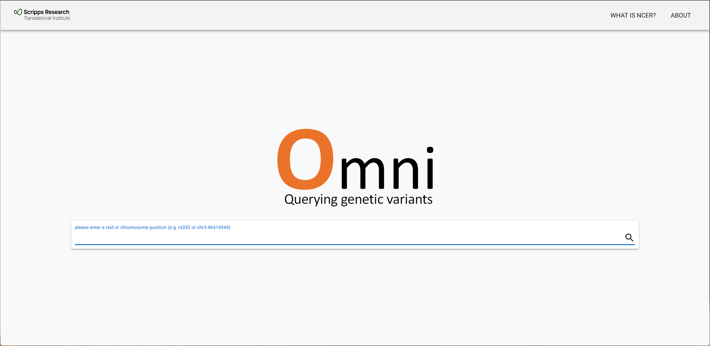
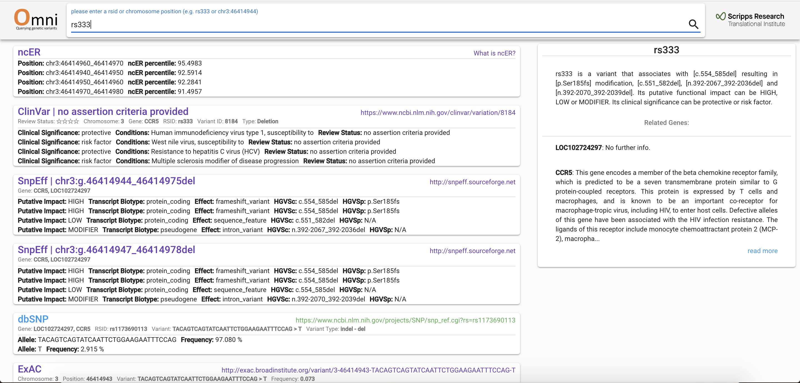
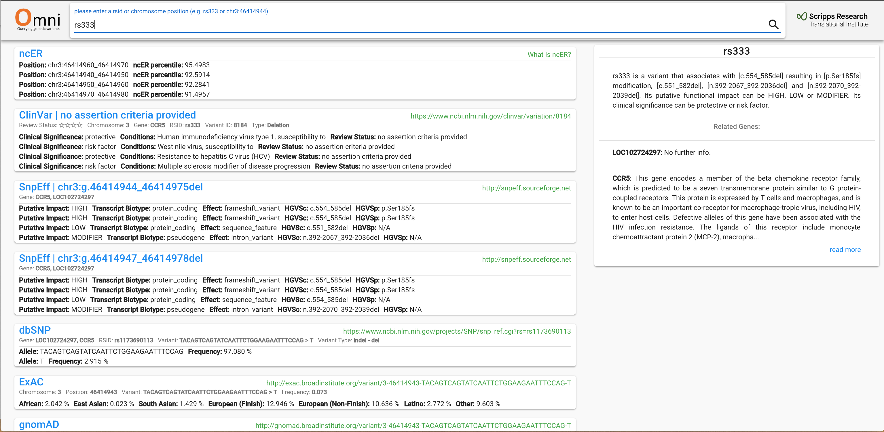
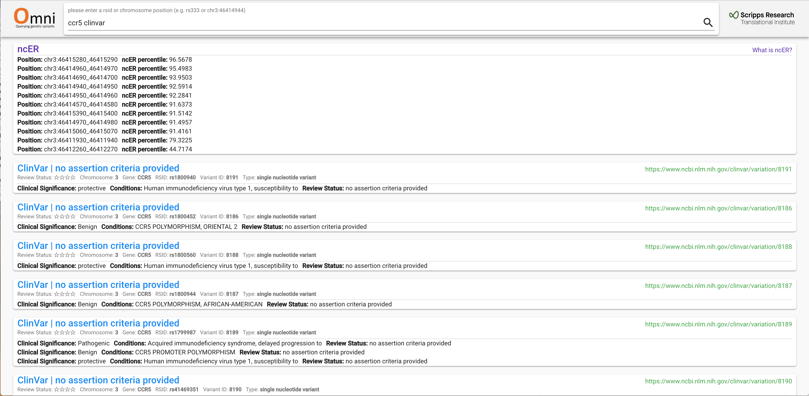
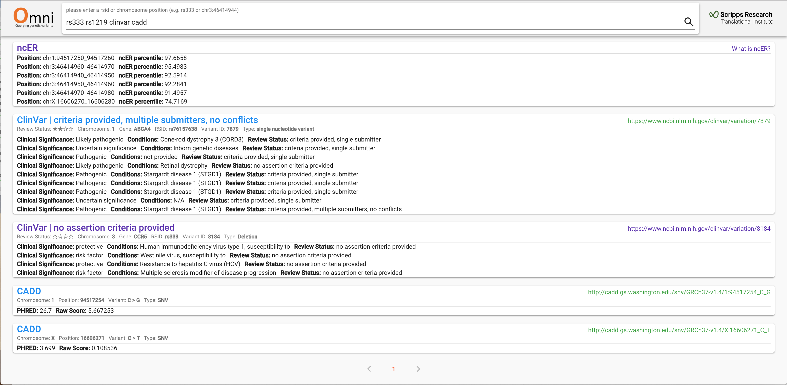

# OMNI Guide

## Introduction

This a public repo to provide guide and collect issues and feedback for **OMNI**, a powerful browser that harmonizes knowledge, functional significance, population prevalence and available literature at the single nucleotide level. More info about Omni can be found at: [https://omni.telentilab.com/about](https://omni.telentilab.com/about)

## Quick View

This guide covers these topics:
- [What Is Omni](#introduction)
- [What Is New](#what-is-new)
- [Data Sources](#data-sources)
- [What Is ncER](#what-is-ncer)
- [How To Search Omni](#how-to-search-omni)
- [Issues & Feedback](#issues-&-feedback)

## What Is New

**Variant Summary**: In the most recent release, we added a summary box that will show up when the user is querying a specific variant with *rsid*. Some high-level information will be extracted and processed into a introduction wiki, summary on related genes will also be displayed when available.

## Data Sources

The current Omni version aggregates knowledge from these data sources:
- CADD ([https://cadd.gs.washington.edu](https://cadd.gs.washington.edu))
- ClinVar ([https://www.ncbi.nlm.nih.gov/clinvar/intro](https://www.ncbi.nlm.nih.gov/clinvar/intro/))
- dbSNP ([https://www.ncbi.nlm.nih.gov/projects/SNP/get_html.cgi?whichHtml=overview](https://www.ncbi.nlm.nih.gov/projects/SNP/get_html.cgi?whichHtml=overview))
- ExAC ([http://exac.broadinstitute.org/about](http://exac.broadinstitute.org/about))
- gnomAD ([http://gnomad.broadinstitute.org/about](http://gnomad.broadinstitute.org/about))
- ncER ([What is ncER?](#what-is-ncer?))
- SnpEff ([http://snpeff.sourceforge.net/SnpEff.html](http://snpeff.sourceforge.net/SnpEff.html))
- PubMed ([https://www.ncbi.nlm.nih.gov/pubmed/](https://www.ncbi.nlm.nih.gov/pubmed/))

More data sources are to be added in future releases. If you have any preference or recommendation, please feel free to raise an issue in this GitHub repo. For more information, please refer to the [Issues & Feedback](#issues-&-feedback) section.

## What is ncER
The non-coding Essential Regulation (ncER) score is a resource developed by The Scripps Research Translational Institute together with researchers from UC San Diego and Los Angeles, and Stanford, with the goal of providing precomputed analytics to all nucleotides in the human genome. The metric is trained primarily on non-coding genome features and on non-coding pathogenic variants. It should not be used for the analysis of the protein coding regions.

ncER scores identify the most essential sequence segments in the non-coding genome to support the mapping of regulatory regions of critical function. It serves also to prioritize regulatory genetic variants in the investigation of rare diseases. The scores are presented as percentiles. Suggested percentile thresholds indicative of essentiality are: 95%, 99%, 99.5%, 99.9%.

For more info, please refer to: [https://omni.telentilab.com/ncer](https://omni.telentilab.com/ncer)

## How To Search Omni

### Before we start

Omni is in a very preliminary stage at the moment, features are limited and your feedback would be much appreciated.

### Search terms

For now, these search terms are supported:
- **rsid**: use the rsid of the variant as search term (e.g rs333).
- **chromosomal position**: use the pattern `chromosome:position` to search for variants on a specific position (e.g chr3:46414944).
- **gene name**: use the gene name (symbol) to search for variants related to a specific gene (e.g CCR5).
- **anything else**: you may search with anything else and in this case, Omni will try to find anything that matches in PubMed articles. For example, you may search for `Julia Di Iulio` and it will show all articles from PubMed that have *Julia Di Iulio* as the author. 

By default, Omni displays data from all sources that are available.

### Specifying Sources

If you wish to search for a specific source, you may append the source name behind the search term. For example, `"ccr5 clinvar"` will show only *ClinVar* data for the gene *CCR5*. 

P.S: for the current version, we wish to highlight our ncER scores, so it would always appear on the top of first page.

### Semantic Search

A common complaint about many variant browsers is that the search pattern has to be very specific. Omni attempts to make it easier for you by allowing:

- **case-insensitive search**: Don't bother to turn on/off the CAPS on your keyboard/phone. `Rs333` is fine, so is `ccr5`.
- **smart capture for chromosomal position**: Switching from another browser with a different delimiter? That's fine. `chr3:46414944`, `chr-3-46414944`, `chr3-46414944`, `chr 3 46414944` all work. Any non-word character can be used as the delimiter.

### Compound Search

Any search patterns mentioned above can be used together, if they make sense to you. Omni will try to be as smart as possible. For example, `rs333 rs151 clinvar cadd` will search for both `rs333` AND `rs151` on either `clinvar` OR `cadd`.

If you found a particular search pattern that doesn't return desired result, feel free to raise an issue in this repo and we may take a look how we can improve.

## Issues & Feedback

As Omni is in a very preliminary stage and is actively under development. Please feel free to reach us should you have any opinions, feature requests, or issues. 

We recommend that you **raise an issue** in this repo, which is under regular watch, by going the the [**Issues**](https://github.com/TelentiLab/Omni/issues) tab on top of the page. We also recommend that you **search the existing issues** first before raising a new one. Great minds think alike, so there might be an existing issue thread, either open or closed, discussing the problem that may contain helpful information for you.

Alternatively, you may use the contacts in the about page ([https://omni.telentilab.com/about](https://omni.telentilab.com/about)) if you wish to contact specific personnel.
